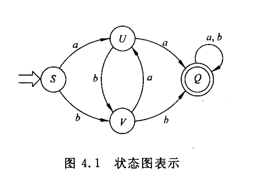
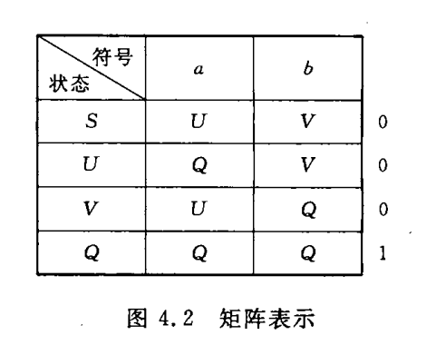
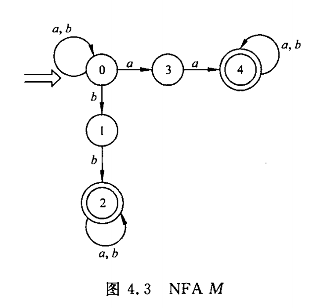

参考资料: 《编译原理(第2版)》(清华大学， 张素琴等) , 第4章 - 词法分析

有限自动机 (Finite Automata) 作为一种识别装置，它能准确的识别正规集。

#### 确定性有限自动机(Deterministic Finite Automata, DFA)
一个确定性有限自动机M是一个五元组: M=(K,∑,f,S,Z)，其中
1. K是一个有限集，它的每个元素称为一个**状态**；
2. ∑是一个有限字母表，它的每个元素称为一个**输入符号**，所以也称∑为输入符号表；
3. f是转换函数，是 K×∑->K 上的映像，即，如f(ki, a) = kj (ki ∈ K, kj ∈ K) 就意味着，
当前状态为Ki, 输入字符为a时，将转换到下一状态kj, 我们把kj称作ki的一个后继状态；
(从状态K接收输入字符a，可以到达一个确定的后继状态。确定性由此而来？)
4. S ∈ K, 是唯一的一个**初态**；
5. Z ∈ K，是一个**终态**集，终态也称**可接受状态**或**结束状态**。 

一个DFA可以表示为一个状态转移图：  
  
也可表示为一个矩阵：   
  

DFA M所能接受的符号串全体记为L(M)
#### 非确定性有限自动机(Nondeterministic Finite Automata, NFA)
一个不确定性有限自动机M是一个五元组: M=(K,∑,f,S,Z)，其中
1. K是一个有限集，它的每个元素称为一个**状态**；
2. ∑是一个有限字母表，它的每个元素称为一个**输入符号**；
3. f是转换函数，是 K×∑\*到K的子集的映像，即，K \* ∑\* -> 2K，
其中2K表示K的幂集。  (在状态K接收输入字符a，可能到达多个后继状态B1, B2...??)
4. S ∈ K, 是一个非空初态集；
5. Z ∈ K，是一个**终态**集。 

 

显然DFA是NFA的特例。 对于每个NFA M，存在一个DFA M'，使得L(M)=L(M') 

对于任何两个有穷自动机M和M'，如果L(M)=L(M')，则称M和M'是等价的。 

#### NFA转换为等价的DFA
在有穷自动机的理论里，有这样的定理：设L为一个由不确定的有穷自动机接受的集合，则存在一个接受L的确定性有穷自动机。

**子集法** 将NFA转换成等价的DFA ......

#### DFA的化简(最小化)
我们说一个DFA是化简了的，也就是说，它没有**多余状态**并且它的状态中没有两个是互相**等价**的。

一个DFA可以通过消除无用状态和合并等价状态而转换成一个**最小的**与之等价的DFA

所谓DFA的无用状态，是指：从该自动机的开始状态出发，任何输入串都不能到达的状态；或者从这个状态没有通路到达终态。 

对于给定的DFA，如果它含有无用状态，可以非常简单的将无用状态消除，而得到与他等价的DFA。 

DFA中两个状态s和t等价的条件是：
1. 一致性条件——状态s和t必须同时为可接受或不可接受状态
2. 蔓延性条件——对于所有输入符号，状态s和状态t必须转换到等价的状态。 